# Awesome-Cloud-Domain-Name-System-DNS-Traffic-Management

# Awesome-Cloud-Domain-Name-System-DNS-Traffic-Management 🌐 ⚡



  





  
  
  
  
  
  



---

## 🌟 Top Cloud DNS & Traffic Management Ecosystem

**Curated List of Commercial DNS Platforms & Open-Source DNS Servers**  
*Focused on Authoritative DNS, Global Server Load Balancing, DNSSEC, Privacy-First Resolvers & Self-Hosted Traffic Steering*

**Last updated: October 2026** 📅

---

### 📌 Overview & SEO Summary
Welcome to the ultimate curated directory of **cloud DNS platforms**, **open-source DNS servers**, and **traffic management frameworks**. Whether you are looking for enterprise-grade commercial solutions (such as *Amazon Route 53*, *Cloudflare DNS*, and *IBM NS1 Connect*), or self-hostable open-source alternatives (like *BIND 9*, *PowerDNS*, and *gdnsd*), this list covers category leaders, anycast routing, and privacy-respecting DNS infrastructure.

---

## 📑 Table of Contents
- [🏢 SaaS & Commercial Platforms](#-saas--commercial-platforms)
- [🔓 Open-Source GitHub Projects](#-open-source-github-projects)
- [🛠️ How to Contribute](#%EF%B8%8F-how-to-contribute)
- [📊 Star History](#-star-history)
- [🤝 Support & Sponsorship](#-support--sponsorship)
- [⚠️ Disclaimer](#%EF%B8%8F-disclaimer)

---

## 🏢 SaaS / Commercial Platforms

The cloud DNS and traffic management market spans **hyperscaler DNS services** (Route 53, Cloud DNS, Azure DNS) that integrate deeply with their respective ecosystems, and **specialized DNS providers** (Cloudflare, NS1, DNS Made Easy) that focus on performance, security, and advanced traffic steering. **Cloudflare** offers **free DNS for all plans** with **no query caps** on Free, Pro, and Business tiers . **Amazon Route 53** charges **EUR 0.40 per million queries** for the first billion, dropping to **EUR 0.20 per million** beyond that . **IBM NS1 Connect** starts at **$113.85/month** for 30–80M queries . **DNS Made Easy** offers a **DNS-50 plan at $175/month** with 50 domains and 50M queries . **Azure DNS** charges **¥3.98 per zone/month** for the first 25 zones and **¥4.07 per million queries** . **Google Cloud DNS** charges **$0.20 per managed zone/month** and **$0.40 per million queries** .

| SaaS / Commercial Platform | Company / Owner | Valuation / Market Cap | Standard Edition Starting Price | Free Tier / Free Trial Limits | Description |
| :--- | :--- | :--- | :--- | :--- | :--- |
| **[Amazon Route 53](https://aws.amazon.com/route53/)** ☁️ | Amazon | ~$2.0 Trillion | **EUR 0.40/million queries** (first 1B); **EUR 0.20/million** (over 1B)  | **Free tier: 50 health checks, 1M queries for 12 months** | **AWS-native DNS** — Authoritative DNS with latency-based, geolocation, geoproximity, and IP-based routing. **Alias records for AWS resources are free** . Resolver endpoints for hybrid cloud DNS. |
| **[Cloudflare DNS](https://www.cloudflare.com/dns/)** 🟠 | Cloudflare | ~$30 Billion | **Free for all plans**; no query caps on Free/Pro/Business  | **Free forever** — unlimited queries, unlimited domains | **Free DNS with global anycast network** — The fastest free DNS provider. **No query caps** on Free, Pro, and Business plans . Enterprise plans use query volume for custom pricing. DNSSEC, DDoS protection, and CDN integration included. |
| **[IBM NS1 Connect](https://www.ibm.com/products/ns1-connect)** 🔵 | IBM | ~$200 Billion | **Essentials: $113.85/month** (30–80M queries)  | **Trial available** | **Traffic steering DNS** — Advanced filter chains, health checks, and real-time traffic management. **Pulsar** for RUM-based multi-CDN steering. **Dedicated DNS** for custom nameservers. |
| **[Azure DNS](https://azure.microsoft.com/en-us/products/dns/)** 🔷 | Microsoft | ~$3.90 Trillion | **¥3.98/zone/month** (first 25 zones); **¥4.07/million queries**  | **Free tier: 12 months for some services** | **Azure-native DNS** — Public and private zones. **Private Resolver** for hybrid DNS (¥1144.8/month per endpoint) . Traffic Manager for global load balancing. |
| **[Google Cloud DNS](https://cloud.google.com/dns)** 🌐 | Google (Alphabet) | ~$2.0 Trillion | **$0.20/zone/month** (first 25); **$0.40/million queries**  | **$300 free credits** for new customers | **GCP-native DNS** — Public, private, and forwarding zones. **Routing policies** (weighted round robin, geolocation, failover). VPC-scope DNS for GKE . |
| **[Oracle Dyn](https://www.oracle.com/cloud/networking/dns/)** 🔴 | Oracle | ~$300 Billion | **$100–$2,000/month** (custom pricing)  | **No free tier**; demo available | **Enterprise DNS** — Formerly Dyn. Traffic management, health checks, and failover. Acquired by Oracle in 2016. |
| **[DNS Made Easy](https://dnsmadeeasy.com/)** 🟢 | Tiggee LLC | Private | **DNS-50: $175/month** (50 domains, 50M queries)  | **No free tier**; **30-day trial available** | **Performance DNS** — **100% uptime for 13 years running** . Global Traffic Director for geo load balancing. Failover records, anomaly detection, and DNS analytics. |
| **[Constellix](https://constellix.com/)** 🟣 | Tiggee LLC | Private | **Usage-based pricing**  | **Free trial available** | **Advanced DNS traffic management** — **Real-time traffic steering** with GeoDNS, failover, and load balancing. **Infrastructure monitoring** integrated. Part of the DNS Made Easy family. |
| **[Akamai Edge DNS](https://www.akamai.com/)** 🟡 | Akamai | ~$15 Billion | **Custom pricing**; Professional Services **$10K–$50K+**  | **No free tier**; demo available | **Enterprise DNS on the Akamai edge** — **Global anycast network** with DDoS mitigation. Integrated with Akamai's CDN and security platform. |
| **[Neustar UltraDNS](https://www.home.neustar/)** 🔵 | TransUnion | ~$10 Billion | **$49/month** (starting)  | **No free tier**; **14-day free trial** | **Enterprise DNS** — **Geo & ASN routing**, dual DNS redundancy, DNSSEC. **DDoS-protected global anycast network**. SSO & RBAC. |

---

## 🔓 Open-Source GitHub Projects

*Sorted by GitHub_Stars_Count (Descending)* 🌟

- **[BIND 9](https://github.com/isc-projects/bind9)**   
  **The most widely deployed DNS server on the internet**, MPL-2.0 licensed. **Mirror of ISC GitLab repository** — submit issues and PRs via GitLab . **Authoritative and recursive DNS**. **DNSSEC support**, views, ACLs, and response policy zones (RPZ). **The reference implementation** for DNS protocol standards. Powers root nameservers, TLDs, and millions of domains. 🏛️

- **[Pi-hole](https://github.com/pi-hole/pi-hole)**   
  **Network-wide ad blocking via DNS**, EUPL-1.2 licensed. **Blackhole for Internet advertisements** with a GUI for management and monitoring . **DNS sinkhole** blocks ads and trackers for every device on your network. **Docker support**. **The most popular self-hosted DNS management tool** for home and small business networks. 🕳️

- **[Technitium DNS Server](https://github.com/TechnitiumSoftware/DnsServer)**   
  **Authoritative and recursive DNS server with ad blocking**, open-source. **Docker and C#** platforms . **Self-hosted alternative to Pi-hole** with both authoritative and recursive capabilities. **Web-based management console**. **Blocklist support** for ad and tracker blocking. 🛡️

- **[AdGuard Home](https://github.com/AdguardTeam/AdGuardHome)**   
  **User-friendly ads and trackers blocking DNS server**, GPL-3.0 licensed. **Docker deployment** . **Network-wide ad blocking** with a polished web interface. **Parental controls** and safe search enforcement. **DNS-over-HTTPS and DNS-over-TLS** upstream support. 🚫

- **[gdnsd](https://github.com/gdnsd/gdnsd)**   
  **Authoritative DNS server** . **High-performance** with a focus on **authoritative-only DNS**. **Plugin architecture** for extensibility. **Built for anycast deployments** with fast startup and low memory footprint. ⚡

- **[blocky](https://github.com/0xERR0R/blocky)**   
  **Fast and lightweight DNS proxy as ad-blocker**, Apache-2.0 licensed. **Go and Docker** . **Alternative to Pi-hole** with a focus on performance. **DNS-over-HTTPS, DNS-over-TLS, and DNSCrypt** support. **Conditional forwarding** for split DNS. 🚀

- **[sdns](https://github.com/semihalev/sdns)**   
  **High-performance recursive DNS resolver with DNSSEC support**, open-source. **Privacy-focused** . **DNS-over-TLS, DNS-over-HTTPS, and DNS-over-QUIC** support. **Caching, prefetching, and access control lists**. **The privacy-conscious alternative to public resolvers**. 🔒

- **[routedns](https://github.com/folbricht/routedns)**   
  **DNS stub resolver, proxy and router**, open-source. **DoT, DoH, DoQ, and DTLS** support . **Route DNS queries based on rules** — block, allow, forward, or rewrite. **Build custom DNS filtering pipelines**. 🔀

- **[mosdns](https://github.com/IrineSistiana/mosdns)**   
  **A DNS forwarder** . **Plugin-based DNS routing** with support for multiple upstreams. **GeoIP and domain-based routing**. **Caching and prefetching**. **The go-to tool for custom DNS forwarding rules** in China and beyond. 🌏

- **[dns.toys](https://github.com/knadh/dns.toys)**   
  **DNS server that offers useful utilities over the DNS protocol**, open-source. **2,512 stars, 137 forks** . **Weather, world time, unit conversion, and more** — all via DNS queries. **A creative demonstration of DNS as a data protocol**. 🎮

- **[acme-dns](https://github.com/joohoi/acme-dns)**   
  **Limited DNS server with RESTful HTTP API for ACME DNS challenges**, open-source . **Secure ACME DNS-01 challenge handling** without exposing your main DNS provider. **RESTful API** for certificate automation. **The standard tool for Let's Encrypt DNS challenges**. 🔐

- **[coredns](https://github.com/coredns/coredns)**   
  **DNS server that chains plugins**, Apache-2.0 licensed. **Kubernetes-native DNS** — the default DNS server for Kubernetes clusters. **Plugin-based architecture** for extensibility. **Service discovery** for Kubernetes services. **The most widely deployed cloud-native DNS server**. ☸️

- **[Gravity](https://github.com/BeryJu/gravity)**   
  **Fully-replicated DNS and DHCP Server with ad-blocking powered by etcd**, open-source . **High availability** through etcd replication. **Combined DNS and DHCP** in a single service. **Ad-blocking** built in. **The most resilient self-hosted DNS solution**. 🌐

---

## 🛠️ How to Contribute

Contributions are welcome! Follow these steps to submit new DNS platforms or open-source DNS software:

1. 🍴 **Fork** the repository.
2. 📝 **Add/edit** entries in `README.md` maintaining table/list structure and formatting.
3. 🔗 Include project title, official website/GitHub link, exact Stars_Count, license, and brief description.
4. 🚀 Submit a **Pull Request** with a descriptive summary of your changes.

---

## 📊 Star History



---

## 🤝 Support & Sponsorship

If you find this cloud DNS repository useful, please consider supporting the project:

- ⭐ **Star** this repository to increase visibility!
- 🔀 **Fork** and share with fellow network engineers, DNS operators, and open-source advocates.
- ☕ **Sponsor & Buy Me a Coffee**: Support ongoing open-source curation via the [GitHub Sponsor Dashboard](https://github.com/sponsors/ishandutta2007).

---

## ⚠️ Disclaimer

- This is a **community-curated** list — not exhaustive and not an endorsement. ℹ️
- **Cloudflare offers free DNS with no query caps** on Free, Pro, and Business plans — the most generous free tier in the market . **Amazon Route 53 charges per query**, which can add up at scale but provides deep AWS integration .
- **DNS Made Easy has a strict no-refund and no-cancellation policy** — all services are one-year terms that auto-renew . **Akamai Edge DNS requires custom pricing with Professional Services of $10K–$50K+** and Premium Support at 10–20% of contract value .
- **BIND 9 is the reference implementation** but has a steeper learning curve than modern alternatives like CoreDNS. **Pi-hole, AdGuard Home, and Technitium** are excellent for home and small business networks but **not designed for authoritative DNS at scale** .
- Open-source DNS servers (BIND, CoreDNS, gdnsd) provide self-hosted ownership and transparency, but enterprise-grade SLA guarantees, global anycast networks, and 24/7 support remain primarily commercial offerings. **Always deploy at least two DNS servers** for redundancy — DNS outages cascade to every service that depends on name resolution. 🌐

---



  <b>Made with ❤️ for network engineers, DNS operators, and open-source DNS advocates.</b>

